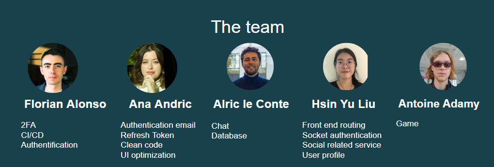
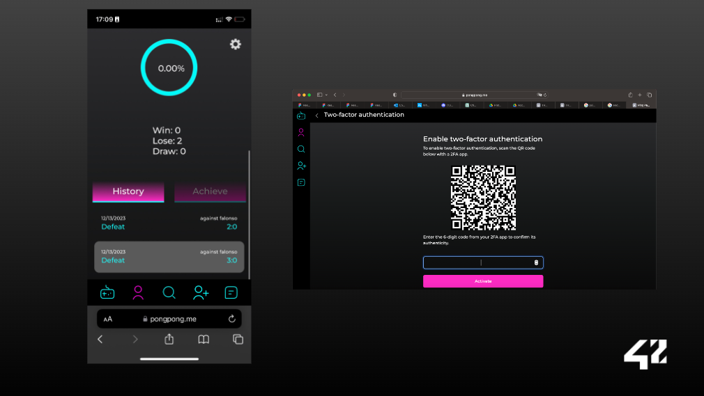
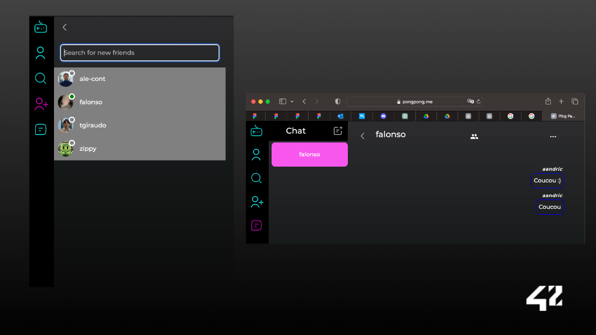
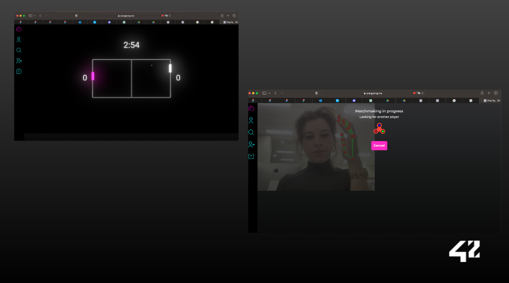
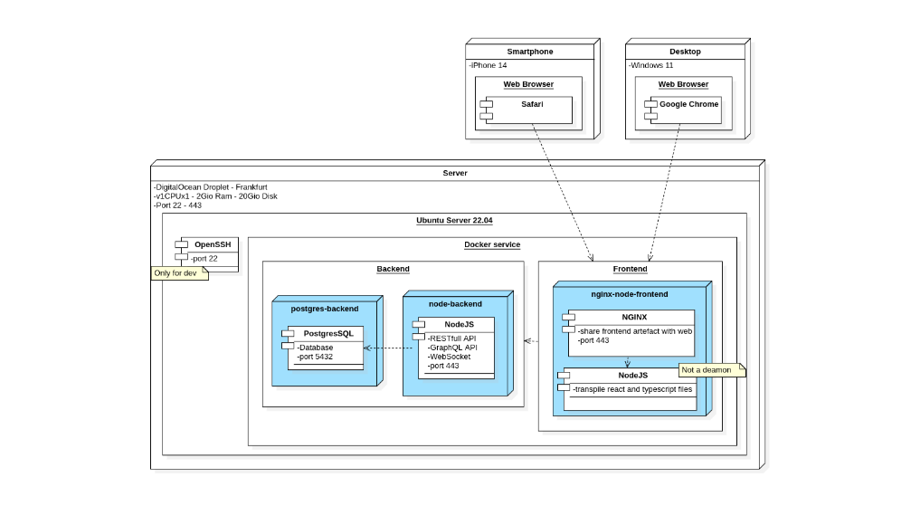
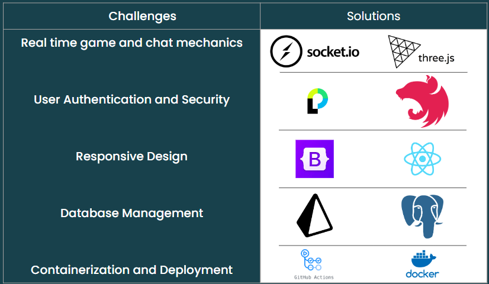
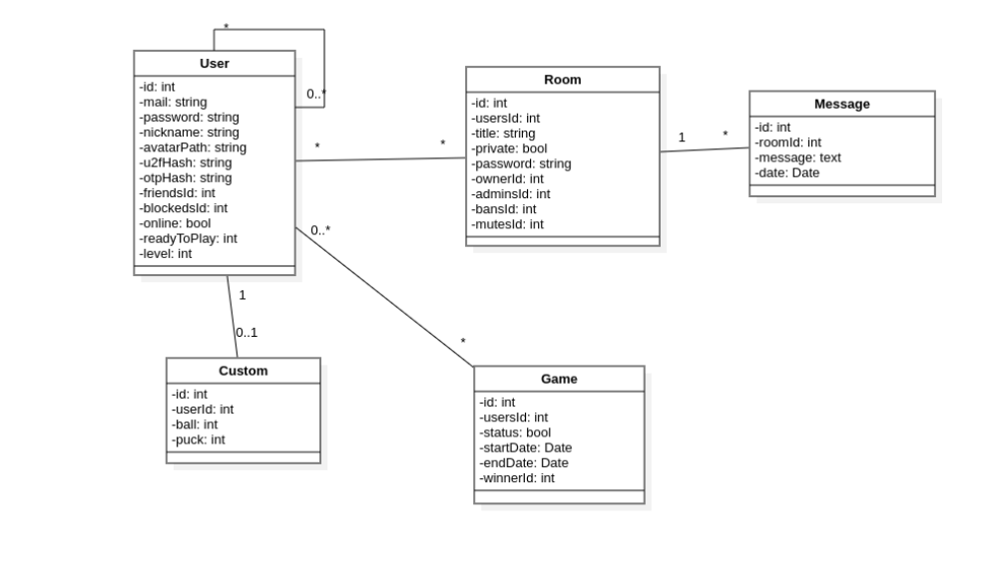

# Transcendence

## Résumé
Bienvenue dans le projet ft_transcendence, où le C et le C++ cèdent la place à une aventure inédite. Ce projet vous invite à revisiter vos débuts en informatique et à briller avec vos compétences actuelles. Préparez-vous à créer un site web pour une compétition du jeu Pong, avec une touche moderne et interactive.

## Table des Matières
1. [Préambule](#préambule)
2. [Partie Obligatoire](#partie-obligatoire)
   1. [Vue d'ensemble](#vue-densemble)
   2. [Questions de sécurité](#questions-de-sécurité)
   3. [Compte utilisateur](#compte-utilisateur)
   4. [Chat](#chat)
   5. [Le jeu](#le-jeu)
3. [Rendu et Peer-Evaluation](#rendu-et-peer-evaluation)

---

## Préambule
Ce projet marque une étape importante dans votre parcours en informatique. Il vous invite à explorer de nouvelles technologies et à créer une application web dynamique et interactive.

## Partie Obligatoire

### Vue d'ensemble
Votre mission est de développer un site web permettant aux utilisateurs de jouer au Pong. Les exigences clés sont :

- **Backend** : NestJS.
- **Frontend** : Framework TypeScript au choix.
- **Bibliothèques** : Utiliser les dernières versions stables.
- **Base de données** : PostgreSQL exclusivement.
- **Application web monopage** : Support des boutons Précédent et Suivant du navigateur.
- **Compatibilité** : Dernière version stable de Google Chrome et un autre navigateur.
- **Gestion des erreurs** : Pas d'erreurs non gérées ou d'avertissements.
- **Déploiement** : Utilisation de `docker-compose up --build`.

### Questions de sécurité
- **Chiffrement des mots de passe** dans la base de données.
- **Protection contre les injections SQL**.
- **Validation côté serveur** pour les formulaires et requêtes utilisateur.
- **Gestion des informations sensibles** via un fichier `.env` exclu de git.

### Compte utilisateur
- **Authentification** via le système OAuth de l'intranet 42.
- **Nom d'utilisateur unique**, téléchargement d'avatar, et avatar par défaut.
- **Authentification à deux facteurs** (2FA).
- **Gestion des amis** et visualisation de leur statut.
- **Affichage des statistiques** et historique des matchs.

### Chat
- **Création de channels** : publics, privés ou protégés par mot de passe.
- **Messages directs** et possibilité de bloquer d'autres utilisateurs.
- **Gestion des channels** par le créateur.
- **Invitations à jouer au Pong** via le chat.
- **Accès aux profils** des joueurs depuis le chat.

### Le jeu
- **Parties de Pong en live** contre d'autres joueurs.
- **Système de matching** automatique.
- **Fidélité au Pong original de 1972** avec options de customisation.
- **Responsive design** et gestion des problèmes de réseau.

## Rendu et Peer-Evaluation
Le projet doit être soumis sur votre dépôt Git. Assurez-vous que la structure des dossiers et des fichiers soit conforme aux exigences du sujet.

---

**Transcendence** : Un voyage à travers le temps et la technologie, du Pong classique à l'ère moderne du développement web.

**Annexes**

