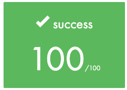
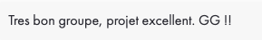

<h1 align="center">Transcendence</h1>


Projet final du tronc commun de [42](https://42.fr/), dont le but est la création d'un site web pour jouer au jeu Pong en ligne.

Ce projet couvre les aspects suivants :

- Développement d'une application web monopage.
- Mise en place d'un backend avec NestJS et d'un frontend en React.
- Intégration d'une base de données PostgreSQL.
- Implémentation de fonctionnalités de sécurité et de gestion des utilisateurs.
- Dockerisation complète du projet.

---

### Fonctionnalités :

#### Compte utilisateur
- Inscription et connexion via OAuth (intranet 42).
- Choix d'un nom d'utilisateur unique et téléchargement d'un avatar.
- Activation de l'authentification à deux facteurs (2FA).
- Gestion des amis et affichage du statut en temps réel.
- Consultation des statistiques et de l'historique des matchs.

#### Chat
- Création de channels (publics, privés, protégés par mot de passe).
- Envoi de messages directs et blocage d'utilisateurs.
- Gestion des channels par les propriétaires et administrateurs.
- Invitation à jouer via l'interface de chat.

#### Jeu
- Lancement de parties de Pong en temps réel contre d'autres joueurs.
- Système de matchmaking automatique.
- Options de personnalisation et jeu fidèle au Pong original.
- Jeu responsive et gestion des latences réseau.
- Possibilité d'utiliser les mains comme contrôleur.

---

### Pré-requis :

- Docker >= 26.1.1
- Docker Compose >= v2.27.0

### Configuration et déploiement :

Fichier `.env` à la racine du projet avec les paramètres suivants :

```
ENV=prod
APP_NAME=pingpanpong

REACT_APP_FRONTEND_URL=http://localhost:8080
REACT_APP_BACKEND_URL=http://localhost:8080/api

REACT_APP_FORTYTWO_APP_ID=<secret>
FORTYTWO_APP_SECRET=<secret>

POSTGRES_HOST=db
POSTGRES_PORT=5432
POSTGRES_USERNAME=postgres
POSTGRES_PASSWORD=<secret>
POSTGRES_NAME=transcendence

DATABASE_URL=postgresql://postgres:<secret>@db:5432/transcendence

JWT_SECRET=<secret>

REACT_APP_GITHUB_LINK=https://github.com/
```

Remplacer `<secret>` par des chaînes de caractères aléatoires ou des accès API valides.

#### Commandes disponibles :

- `docker-compose up --build` : construction et lancement du projet.

---

### Diagrammes :

##### Diagramme d'entité


##### Diagramme de déploiement


### Démonstration :


---

### Correction :

| |
| --- |
|  |

| | |
| --- | --- |
| Correcteur 1 |  |
| Correcteur 2 |  |
| Correcteur 3 |  |

---

### Contributeurs :

|  |  |  |  |  |
|:----------------------------------------------:|:------------------------------------------------:|:------------------------------------------------:|:-----------------------------------------------:|:-----------------------------------------------:|
| **[Sasha](https://github.com/sasha-liu)**       | **[Antoine](https://github.com/antoineA67)**      | **[Florian](https://github.com/florian-a)**      | **[Alric](https://github.com/alpyt42)**         | **[Ana](https://github.com/noushhhh)**         |
